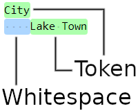

# Plaintext Abstract Tree
## What is PAT?
PAT is a human-readable data format designed for simplicity, readability, and maintainability.
The only syntax required by the format is leading whitespace on each line.
Each line of a PAT file represents a single node of data. A node consists of leading whitespace and any following characters represent the value of that node. The whitespace of a node indicates it to be a child of the last node with less whitespace. Any nodes with the same parent are sibling nodes.

## Why PAT?
The PAT format was constructed out of several requirements. The basis of PAT is to pass data to an application at runtime. In addition, the format should be easy for non-programmers to understand, construct, and modify the data in a PAT. In order for it to be easy for non-programmers, it should also be difficult to get confused by the format and difficult make syntax/structural errors. Other requirements include that the format should be flexible to support any kind of data and also be simple for a computer to parse.

Apart from the necessity to pass data to a program at runtime, the above criteria was also driven by the consideration of several other human-readable data formats, including INI, JSON, YAML, and XML. Each of these existing formats were considered either not flexible enough (such as INI's mixed support for nested structures) or too complicated for non-programmers to read, understand, or maintain without training or practice. The syntax required by these other formats also make the files complex to parse and often requires some overhead.

From these requirements, the PAT format was created, addressing of these issues by being as simple as possible while still allowing for nested structures.

## Examples
Below is the outline of the syntax of two nodes showing a parent-child relationship:
```
City
    Lake Town
```


Here is an example of the basic representation of a PAT file:
```
root
	child
		grandchild
	child
	child
		grandchild
		grandchild
```

An example of a user record with nested properties:
```
User
	ID
		42
	First Name
		John
	Last Name
		Doe
	Age
		23
	Address
		Street
			123 Somewhere Dr.
		City
			Portland
		State
			Oregon
	Email
		john.doe@example.com
```

A PAT file can have multiple root nodes that will all just be siblings of each other.
```
Book
	The Hobbit
Movie
	Lord of the Rings: The Fellowship of the Ring
Book
	Children of Hurin
Music
	May It Be
```

## Types
PAT has no typing system. All tokens are stored as strings. This leaves all interpretation of the nodes up to whatever application loads them.

Since PAT uses plaintext tokens, it's not possible to store binary data. Two possible solutions for storing binary data are to either store a reference to an external binary file that the consuming application should load, or store the binary data encoded in some way such as [base64 encoding](https://en.wikipedia.org/wiki/Base64).
```
Audio
	./music.ogg
Image
	./image.png
Image
	iVBORw0KGgoAAAANSUhEUgAAACAAAAAgBAMAAACBVGfHAAAAGFBMVEUAAAApKihQTk1sbGuMi4uxr7DR0ND///+rKJmzAAAA30lEQVQoz13RPQ+CMBAG4FcQXFnUlcSoq5OujSayGiNhxWh0VcTe37d3rW31BkKe9D7aA5nQdUPfAH9K4AeOsxU2AS5ISSMPUNcnouvsHqXcqAfGEWgNE/bIQsqfGaRsvxQ4MGT8p+wciiE1OV0aARrTvaKQgjWpzI0uRZGdOUvgJTAc+Mu9V1J15IG2DIMqwLu0bTzQqYB7Ewf9vPwFvUuAKgZMgagLPRIqzMt50Kj5QgHaXC608ZPycz1sEbuXJQlkDtSE9QnZhYEusbNh74qWbmt7N2kb9moBzR/8xQfcrrDclEIZCAAAAABJRU5ErkJggg==
```

## Whitespace
Leading whitespace may be of any whitespace characters and in any order or amount. Child nodes are defined by fully matching the leading whitespace of its parent exactly and must include additional whitespace for them to constitute as children. If no previous node in the hierarchy exist with exact matching leading whitespace to legitimize the parent-child relationship, then the node will have no parent and be a root node.
```
root
	A: child of root
	B: child of root
		C: child of B
			D: child of C
		E: child of B
	F: child of root
```

In the case of mixed tabs/spaces, the readability becomes difficult, so it's recommended that whitespace be used consistently throughout a PAT file. For reference, the following example which uses mixed tabs/spaces explains how they would be interpreted.
```
root
	A: 1 tab; child of root
    B: 4 spaces; child of root
    	C: 4 spaces 1 tab; child of B
		D: 2 tabs; child of root
    	E: 4 spaces 1 tab; child of root
```
In the above example, C is a child of B because it includes the same leading whitespace as B. D, despite appearing to be indented as much as C and more than B, it's indentation doesn't match either which makes it a child of root. E is not a child of B, although having the same leading whitespace, the previous node (D) breaks the hierarchy of B by being a child of root and sibling to B.

It is not recommended to mix whitespace characters like this for readability reasons, yet it is allowed by the standard. To normalize the leading whitespace of a PAT formatted file, see the [PATNormalizer](./examples/patnormalizer/patnormalizer.cpp) example program.

### Blank lines
Blank lines are ignored.

### Tokens with leading whitespace
If a node's value needs to begin with a whitespace, it's up to the program or user that generates the PAT to use some kind of delimiter, such as a special character to mark the beginning of the token or quote marks wrapping the value, which the consuming application should know to ignore. In a similar way, data that requires multiple lines may just be stored as siblings of each other and the consuming application can concatenate them together as required.

Example of requiring leading whitespace in a token:
```
Quote
	"    This is a line with leading whitespace.
	"We can put another quote at the beginning of this line if we want.
	"The consuming application just needs to know to ignore leading quotes.
	Or we can just require consuming applications to ignore leading quotes if any,
	but not require one.
	""This line starts with a quote, but if we don't want it to be ignored, the consuming application just needs to know that it can only ignore the first leading quote if any.
	"Or we can write it like this and the consuming application needs to know to only ignore the leading quote if it's not followed by whitespace, in which case the second and third lines above would in fact include a leading quote and not ignore them.
	It's all up to how the application is written to parse the PAT.
```

## Structures
Below are some examples of how some common structures may written.
### List/Array/Set
```
Shopping List
	Apples
	Carrots
	Bread
```
Sets by definition must only contain unique values, but the PAT format does not enforce this. Instead it is up to the parser to catch the duplicate values and/or choose which duplicate to ignore. If using the included [PAT API](./src/cppapi/README.md), the `operator[]` operator will return the last node with a matching token, so any preceding duplicates are ignored.

### Map/Associative Array
```
Chess piece values
	pawn
		1
	knight
		3
	bishop
		3
	rook
		5
	queen
		9
```
Note that it's possible to have duplicate keys, so it's up to the parser to determine how to handle duplicate keys. As with parsing sets, if the included [PAT API](./src/cppapi/README.md) is used, the `operator[]` operator may be used to retrieve only the final node of a particular token, and the `GetValue()` method may be used to retrieve only the token of the final child node.

----

## PAT API

A C++ API is included for loading and parsing PAT files. It can be accessed [here](./src/cppapi/)

A C API is included for loading and parsing PAT files. It can be accessed [here](./src/capi/)
